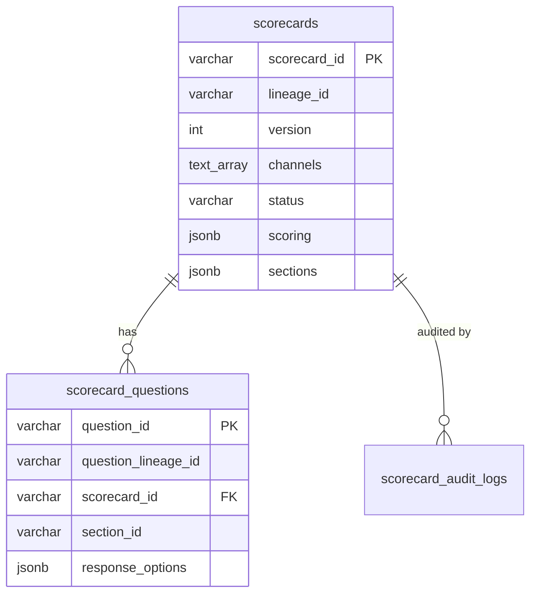

# Scorecard PostgreSQL Schema

**Version:** 2.0  
**Database:** PostgreSQL 16+  
**Service:** Call QA / QA Automation v2  
**Last updated:** 2026-03-17

This document describes the PostgreSQL schema for scorecards (2-table design) and the algorithm used to assemble a **full scorecard** (header + sections + hydrated questions) for downstream consumers such as scoring engines, DataSync, and UI clients.

---

## 1. Design overview

A scorecard version is stored across **two core tables**:

| Table | Role |
|---|---|
| `scorecards` | Versioned header + embedded `sections` JSONB (structure and question references) |
| `scorecard_questions` | Full question documents for one scorecard version |

Supporting tables:

| Table | Role |
|---|---|
| `scorecard_audit_logs` | Append-only change history |
| `platform_dropdown_configs` | Admin-editable Channel / State lists per module |

### Why 2 tables?

Benefits:

- **Simple reads** — full structure in 2 queries (scorecard row + all questions)
- **Scales to 100+ sections** — JSONB stores only section metadata + UUID references (~1 KB per section), not question content
- **Question content stays relational** — easy to validate, update, and bulk-fetch for scoring
- **API-compatible** — consistent JSON shape for frontend and export/import

### Identity model

| ID | Scope | Purpose |
|---|---|---|
| `scorecard_id` | Stable across versions | Logical scorecard id (QA config). Primary key with `version`. |
| `lineage_id` | Same as `scorecard_id` | Kept for backward compatibility; equals `scorecard_id` on create. |
| `section_id` | One per section record | Unique within a scorecard version. Changes on clone/import. |
| `section_lineage_id` | Stable across versions | Tracks the same logical section across versions and audit. |
| `question_id` | One per question record | Unique globally. Referenced in `sections[].questions[]`. |
| `question_lineage_id` | Stable across versions | Used in **export/import** payloads for portability. |

> **Important:** `sections[].questions[]` stores `question_id` (not `question_lineage_id`). Export translates IDs back to lineage IDs for portability.

---

## 2. Entity relationship



**Embedded in `scorecards.sections` JSONB:**

```
sections[] → { section_id, section_lineage_id, name, sequence, weighting, fail_section, questions[] }
questions[] → ["question_id_1", "question_id_2", ...]   (ordered references, not full objects)
```

---

## 3. Table definitions

### 3.1 `scorecards`

One row = one **version** of a scorecard. Sections are embedded as JSONB.

| Column | Type | Required | Description |
|---|---|---|---|
| `scorecard_id` | VARCHAR(64) | PK (with `version`) | Stable logical id. |
| `lineage_id` | VARCHAR(64) | Yes | Same value as `scorecard_id` for new scorecards. |
| `version` | INTEGER | PK (with `scorecard_id`) | Starts at 1. Increments on draft. |
| `name` | VARCHAR(500) | Yes | Display name. |
| `description` | TEXT | No | Optional description. |
| `channels` | TEXT[] | Yes | e.g. `INBOUND_CALL`, `OUTBOUND_CALL`, `CHAT`, `TICKET`, `AGENT_ASSIST`. |
| `status` | VARCHAR(20) | Yes | `DRAFT` \| `PUBLISHED` \| `DISABLED` \| `ARCHIVED` |
| `state` | VARCHAR(100) | No | Line-of-business / state filter for auto-selection. |
| `scorecard_type` | VARCHAR(100) | No | e.g. general QM, compliance. |
| `fail_scorecard` | BOOLEAN | Yes | If true, one failing answer fails the entire evaluation. |
| `scoring` | JSONB | No | Scoring policy (see §5.1). |
| `sections` | JSONB | Yes | Embedded section array (see §5.3). Default `[]`. |
| `total_sections` | INTEGER | Yes | Denormalized count for list screens. |
| `total_questions` | INTEGER | Yes | Denormalized count for list screens. |
| `content_updated_at` | TIMESTAMPTZ | No | Set when sections/questions change. Use for cache invalidation. |
| `model_provider` | VARCHAR(200) | No | AI provider for scoring. |
| `ai_model` | VARCHAR(200) | No | AI model name. |
| `origin` | VARCHAR(20) | Yes | `CREATED` \| `CLONED` \| `IMPORTED` |
| `source_scorecard_id` | VARCHAR(64) | No | Populated when cloned/imported. |
| `source_lineage_id` | VARCHAR(64) | No | Populated when cloned/imported. |
| `published_at/by` | TIMESTAMPTZ / VARCHAR | No | Set on publish. |
| `disabled_at/by` | TIMESTAMPTZ / VARCHAR | No | Set on disable. |
| `enabled_at/by` | TIMESTAMPTZ / VARCHAR | No | Set when re-enabled from DISABLED. |
| `archived_at/by` | TIMESTAMPTZ / VARCHAR | No | Set on archive. |
| `created_by` | VARCHAR(255) | Yes | Author email/ID. |
| `updated_by` | VARCHAR(255) | Yes | Last editor. |
| `created_at` | TIMESTAMPTZ | Yes | Row creation time. |
| `updated_at` | TIMESTAMPTZ | Yes | Row metadata update time. |

**Indexes:** `(lineage_id, version DESC)`, `(status)`, GIN on `(channels)`, GIN on `(sections)`.

---

### 3.2 `scorecard_questions`

| Column | Type | Required | Description |
|---|---|---|---|
| `question_id` | VARCHAR(64) | PK (with scorecard id + version) | Stable across versions; new id only for new questions. |
| `question_lineage_id` | VARCHAR(64) | Yes | Same as `question_id` for new questions. |
| `scorecard_id` | VARCHAR(64) | FK | Parent logical scorecard. |
| `scorecard_version` | INTEGER | FK | Matches `scorecards.version` for this row. |
| `scorecard_lineage_id` | VARCHAR(64) | Yes | Parent lineage (denormalized). |
| `section_id` | VARCHAR(64) | Yes | Owning section in this version. |
| `section_lineage_id` | VARCHAR(64) | Yes | Owning section lineage (denormalized). |
| `sequence` | INTEGER | Yes | Order hint within section (used when sorting hydrated output). |
| `version` | INTEGER | Yes | Question version counter (starts at 1). |
| `question_text` | TEXT | Yes | Prompt shown to AI / reviewer. |
| `question_type` | VARCHAR(50) | Yes | See §4. |
| `response_options` | JSONB | Yes | Array of options (see §5.2). Default `[]`. |
| `fail_section` | BOOLEAN | Yes | Any `is_fail` option fails the parent section. |
| `critical` | BOOLEAN | Yes | Any `is_fail` option fails the entire scorecard. |
| `scorable` | BOOLEAN | Yes | False = excluded from score/denominator. |
| `enabled` | BOOLEAN | Yes | False = skipped entirely. |
| `evidence_source` | VARCHAR(100) | No | Required before publish for scorable questions. |
| `max_score` | NUMERIC | No | Max points for this question. |
| `weight` | NUMERIC(6,2) | Yes | Weight within section (0–100). |
| `ai_instructions` | TEXT | No | Instructions for the AI scorer. |
| `created_by` / `updated_by` | VARCHAR(255) | Yes | Audit fields. |
| `created_at` / `updated_at` | TIMESTAMPTZ | Yes | Timestamps. |

---

### 3.3 `scorecard_audit_logs` (append-only)

| Column | Type | Description |
|---|---|---|
| `scorecard_id` | VARCHAR(64) | Version where event occurred. |
| `scorecard_lineage_id` | VARCHAR(64) | For cross-version history. |
| `scorecard_version` | INTEGER | Version number at time of event. |
| `entity_type` | VARCHAR(20) | `SCORECARD` \| `SECTION` \| `QUESTION` |
| `entity_id` / `entity_lineage_id` | VARCHAR(64) | Target entity. |
| `action` | VARCHAR(50) | e.g. `CREATED`, `PUBLISHED`, `QUESTION_ADDED`, … |
| `before` / `after` | JSONB | Changed fields only. |
| `actor_id` / `actor_email` | VARCHAR(255) | Who performed the action. |
| `created_at` | TIMESTAMPTZ | Event timestamp. |

---

### 3.4 `platform_dropdown_configs`

| Column | Type | Description |
|---|---|---|
| `id` | VARCHAR(64) | PK (UUID). |
| `module_name` | VARCHAR(255) | Unique module key (e.g. `qa_automation_v2`). |
| `dropdowns` | JSONB | Array of `{ dropdown_name, dropdown_values[] }`. |
| `created_at` / `updated_at` | TIMESTAMPTZ | Timestamps. |

---

## 4. Enumerations

### Status lifecycle

```
DRAFT → PUBLISHED → DISABLED → PUBLISHED (re-enable)
                 ↘ ARCHIVED (from any status via archive)
DRAFT → (hard delete allowed)
```

### Channels

`INBOUND_CALL`, `OUTBOUND_CALL`, `CHAT`, `TICKET`, `AGENT_ASSIST`

### Question types

`SINGLE_SELECT`, `MULTI_SELECT`, `YES_NO`, `NUMERIC`, `TEXT`

Select types require `response_options`.

### Evidence sources

`TRANSCRIPT`, `DESKTOP_ACTION`, `CRM_RECORD`, `AUDIO_ACOUSTIC`, `EXTERNAL_SYSTEM`

---

## 5. JSONB structures

### 5.1 `scorecards.scoring`

```json
{
  "scoring_mode": "WEIGHTED",
  "min_applicable_points": 10,
  "critical_zeroes_score": false
}
```

### 5.2 `scorecard_questions.response_options`

```json
[
  {
    "label": "Yes",
    "value": "YES",
    "points": 10,
    "is_fail": false,
    "excluded_from_denominator": false,
    "routes_to_human": false
  },
  {
    "label": "Not Applicable",
    "value": "NA",
    "points": null,
    "is_fail": false,
    "excluded_from_denominator": true,
    "routes_to_human": false
  }
]
```

Reserved option values: `NA`, `CANNOT_DETERMINE`.

### 5.3 `scorecards.sections`

Array of section objects. Each section holds **question_id references only** (not full question objects).

```json
[
  {
    "section_id": "uuid",
    "section_lineage_id": "uuid",
    "name": "Greeting",
    "sequence": 1,
    "weighting": 50,
    "fail_section": false,
    "questions": ["question_id_1", "question_id_2"]
  },
  {
    "section_id": "uuid",
    "section_lineage_id": "uuid",
    "name": "Compliance",
    "sequence": 2,
    "weighting": 50,
    "fail_section": true,
    "questions": ["question_id_3"]
  }
]
```

**Capacity:** Supports 100+ sections per scorecard. JSONB size stays small (~1 KB per section) because only UUID references are stored, not question content.

**Constraints (application-enforced):**

- Section `weighting` values should sum to **100** across all sections
- `questions[]` order defines display/evaluation order within the section
- Each `question_id` in `questions[]` must exist in `scorecard_questions` for the same `scorecard_id`

---

## 6. Algorithm: get full scorecard

There are two assembly levels:

| Level | `sections[].questions` contains | Use case |
|---|---|---|
| **Partial** (list / lightweight) | `question_id` strings | List screens, export prep |
| **Full** (detail / scoring) | Complete question objects | Scoring engine, editor UI |

### Step-by-step (Full scorecard)

**Input:** `scorecard_id`

#### Step 1 — Fetch scorecard (header + sections JSONB)

```sql
SELECT * FROM scorecards WHERE scorecard_id = $1;
```

If no row → scorecard not found. The `sections` column contains the embedded structure with `question_id` references.

#### Step 2 — Parse sections

Extract `sections` JSONB array. Sort by `sequence ASC`. Each section's `questions` field is an ordered array of `question_id` strings.

#### Step 3 — Fetch all questions for this scorecard

```sql
SELECT * FROM scorecard_questions
WHERE scorecard_id = $1
ORDER BY sequence ASC;
```

Build a lookup map: `question_id → question object`.

#### Step 4 — Hydrate questions into sections

For each section:

1. Take the ordered `question_id` list from `sections[].questions`.
2. Map each ID through the question lookup map.
3. Drop any IDs with no matching question row (orphans).
4. Sort hydrated questions by `question.sequence ASC`.

Replace `section.questions` (string array) with the full question objects.

#### Step 5 — Return full document

Final shape:

```json
{
  "scorecard_id": "...",
  "lineage_id": "...",
  "version": 2,
  "name": "Inbound Sales QA",
  "channels": ["INBOUND_CALL"],
  "status": "PUBLISHED",
  "scoring": { "scoring_mode": "WEIGHTED", "min_applicable_points": 10 },
  "total_sections": 2,
  "total_questions": 8,
  "sections": [
    {
      "section_id": "...",
      "section_lineage_id": "...",
      "name": "Greeting",
      "sequence": 1,
      "weighting": 50,
      "fail_section": false,
      "questions": [
        {
          "question_id": "...",
          "question_lineage_id": "...",
          "question_text": "Did the agent greet the customer?",
          "question_type": "YES_NO",
          "sequence": 1,
          "max_score": 10,
          "weight": 100,
          "response_options": [ "..." ],
          "evidence_source": "TRANSCRIPT",
          "ai_instructions": "Look for a greeting in the first 30 seconds.",
          "scorable": true,
          "enabled": true,
          "fail_section": false,
          "critical": false
        }
      ]
    }
  ]
}
```

### Pseudocode

```
function getFullScorecard(scorecardId):
    row = query scorecards WHERE scorecard_id = scorecardId
    if not row: return null

    sections = parse JSONB row.sections, sort by sequence ASC
    questions = query scorecard_questions WHERE scorecard_id ORDER BY sequence

    qMap = { q.question_id: q for q in questions }

    for section in sections:
        section.questions = [
            qMap[qid]
            for qid in section.questions
            if qid in qMap
        ]
        sort section.questions by sequence ASC

    return { ...row fields, sections }
```

### Performance notes

- **2 queries total** — scorecard row + all questions (vs 3–4 in the old 4-table design)
- List screens should omit or slim `sections` JSONB if not needed (use `total_sections` / `total_questions`)
- Cache full document keyed on `scorecard_id` + `content_updated_at` for published scorecards
- 100 sections × 20 questions ≈ 65 KB JSONB — well within PostgreSQL limits

---

## 7. Section / question write operations

All section structure changes update the `sections` JSONB on the `scorecards` row (read-modify-write within a transaction):

| Operation | What happens |
|---|---|
| **addSection** | Append new section object to `sections[]`, increment `total_sections` |
| **updateSection** | Find section by `section_id` in JSONB, patch fields, write back |
| **removeSection** | Remove section from JSONB, delete all questions with matching `section_id` |
| **addQuestion** | Insert question row, append `question_id` to section's `questions[]` in JSONB |
| **removeQuestion** | Delete question row, remove `question_id` from section's `questions[]` in JSONB |
| **createDraft** | Clone scorecard row (rewrite `sections` with new IDs), clone all question rows |
| **importScorecard** | Insert scorecard with `sections` JSONB + bulk insert questions |

---

## 8. Common lookup queries

### Get latest PUBLISHED scorecard for a channel

```sql
SELECT * FROM scorecards
WHERE status = 'PUBLISHED'
  AND $1 = ANY(channels)
ORDER BY published_at DESC
LIMIT 1;
```

### Get all versions of a scorecard lineage

```sql
SELECT * FROM scorecards
WHERE lineage_id = $1
ORDER BY version DESC;
```

### Get scorecards needing attention (section weights ≠ 100)

```sql
SELECT scorecard_id FROM scorecards sc
WHERE jsonb_array_length(sc.sections) > 0
  AND (
    SELECT COALESCE(SUM((elem->>'weighting')::numeric), 0)
    FROM jsonb_array_elements(sc.sections) elem
  ) <> 100;
```

---

## 9. Export / import contract

**Export** translates `sections[].questions[]` (`question_id`) → `question_lineage_id` so payloads are portable across environments.

**Import** generates fresh `scorecard_id`, `section_id`, and `question_id` values but preserves the export structure keyed by lineage IDs in the payload.

Export payload shape:

```json
{
  "export_version": "1.0",
  "scorecard": {
    "name": "...",
    "description": "...",
    "channels": ["INBOUND_CALL"],
    "state": "ACTIVE",
    "scorecard_type": "SALES_QA",
    "fail_scorecard": false,
    "scoring": { "scoring_mode": "WEIGHTED", "min_applicable_points": 10, "critical_zeroes_score": false },
    "model_provider": "openai",
    "ai_model": "gpt-4.1",
    "total_sections": 1,
    "total_questions": 2,
    "sections": [
      {
        "section_lineage_id": "...",
        "name": "Greeting",
        "sequence": 1,
        "weighting": 100,
        "questions": ["question-lineage-id-1", "question-lineage-id-2"]
      }
    ]
  },
  "questions": [
    {
      "question_lineage_id": "...",
      "section_lineage_id": "...",
      "question_text": "...",
      "question_type": "YES_NO",
      "response_options": [ "..." ]
    }
  ]
}
```

---

## 10. API reference (for integration)

| Method | Endpoint | Returns |
|---|---|---|
| POST | `/scorecard/create` | Create empty DRAFT scorecard |
| POST | `/scorecard/list` | Paginated list (sections with question_id refs) |
| GET | `/scorecard/detail/:scorecard_id` | **Full scorecard** (hydrated questions) |
| GET | `/scorecard/versions/:lineage_id` | All versions (partial) |
| PATCH | `/scorecard/publish` | Publish DRAFT → PUBLISHED |
| POST | `/scorecard/draft` | Clone to new DRAFT version |
| GET | `/scorecard/export/:scorecard_id` | Portable export payload |
| POST | `/scorecard/import` | Import from export payload |
| POST | `/scorecard/section/add` | Add section to DRAFT scorecard |
| PATCH | `/scorecard/section/update` | Update section on DRAFT scorecard |
| DELETE | `/scorecard/section/remove` | Remove section + its questions |
| POST | `/scorecard/question/add` | Add question to section |
| PATCH | `/scorecard/question/update` | Update question content |
| DELETE | `/scorecard/question/remove` | Remove question from section |

---

## 11. Database setup & migration

### Fresh database

```bash
cd call_qa/callqa_microservice/backend
npm run postgres:migrate
```

Applies `scorecard-schema.sql` (2-table design + audit logs + dropdown configs).

### Upgrade from old 4-table schema

If the database has legacy `sections` and `section_questions` tables:

```bash
npm run postgres:migrate-two-table
```

This script:

1. Adds `sections JSONB` column to `scorecards` (if missing)
2. Backfills JSONB from legacy `sections` + `section_questions` tables
3. Drops legacy tables

Safe to re-run (idempotent).

### Upgrade to stable scorecard / question IDs (composite PKs)

If the database was created with per-version `scorecard_id` values:

```bash
npm run postgres:migrate-stable-ids
```

Rewrites rows so `scorecard_id` is stable per lineage, adds `scorecard_version` on questions, and switches to composite primary keys. Run once per tenant database after deploying the matching application code.

---

## 12. Source files

| File | Purpose |
|---|---|
| `common/database/sql/scorecard-schema.sql` | DDL (2-table design) |
| `common/database/sql/migrate-to-two-table-schema.sql` | Upgrade migration SQL |
| `scripts/run-postgres-migration.js` | Apply schema (fresh or upgrade) |
| `scripts/migrate-to-two-table-schema.js` | Upgrade runner (4-table → 2-table) |
| `repository/scorecard-repository.js` | DB access + JSONB section management |
| `service/scorecard-service.js` | Business logic + question hydration |
